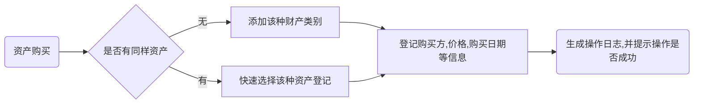
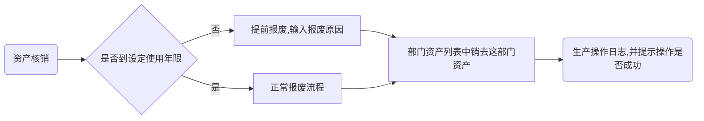

# 第一章、 引言

## 1.1. 项目描述

目前某某公司资产管理混乱，缺乏一个资产登记、划分和报废的平台。亟需一个资产管理平台从资产购买登记、期间划分外借到最后的使用年限将近核销进行统一管理。

## 1.2. 定义

Layui——前端开源框架

Django——基于Python的网页开发框架

Python——一种广泛使用的解释型、高级编程、通用型编程语言

## 1.3. 参考资料

本项目的经核准的计划任务书或合同；

属于本项目的其它已发表的文件；

本文件中各处引用的文件、资料，包括所要用到的软件开发标准

# 第二章、 设计要求

## 2.1. 系统性能要求

要求能够承受行社员工同时使用并且无明显卡顿

## 2.2. 开发环境和运行环境的配置要求

### 2.2.1 开发环境

| 编程软件         | Visual Studio Code |
| ---------------- | ------------------ |
| 文本查看编辑工具 | NotePad++          |
| 版本控制工具     | Git                |
| FTP文件上传工具  | FieZilla           |
| 虚拟终端工具     | Xshell             |

### 2.2.2. 硬件环境

| 最低配置          |                   |
| ----------------- | ----------------- |
| CPU（中央处理器） | 3代酷睿i3 @3.3GHz |
| Memory（内存）    | 4G DDR3 1666MHz   |
| Hard disk（硬盘） | 200GB 5400rpm     |

| 推荐配置          |                   |
| ----------------- | ----------------- |
| CPU（处理器）     | 5代酷睿i5 @3.5GHz |
| Memory（内存）    | 8G DDR3 1666MHz   |
| Hard disk（硬盘） | 500GB 7200rpm     |

### 2.2.3. 软件环境

| 服务器系统 | Windows Server 2008 R2 |
| ---------- | ---------------------- |
| 数据库系统 | MySQL 5.7              |
| Web服务器  | Nginx                  |
| 运行依赖   | Django、Python         |

## 2.3. 系统安全要求

暂无

## 2.4. 其他要求

请使用IE10.0，Edge或者Chrome浏览器进行网页浏览和操作，否则会因为JQuery脚本语言版本过高而造成不支持导致的功能缺失和画面变形，影响正常使用。

# 第三章、 设计内容

## 3.1. 处理流程图

因为Github官网不支持流程图语法，考虑使用图床

## 3.2. 处理流程

### 3.2.1. 资产登记

资产购买回来之后登记其购买日、使用部门、购买价格、使用人是部门还是个人、资产类别、预设报废日期。

### 3.2.2 资产划调

在部门向其他部门借调资产时，需做好相关登记，借调过去是个人使用还是集体使用，借调事由，预计归还日期。

### 3.2.3. 资产核销

再资产达到了其预设的使用年限，系统会发出资产核销提醒，管理员可以选择手动延长其使用年限也可进入核销流程。
